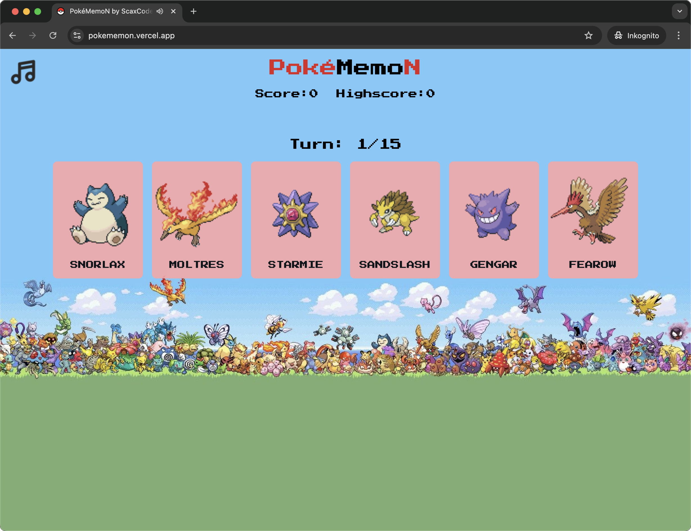

  

# Pokémon Memory Game

This is a fun, interactive Pokémon memory game built with React. The objective is to choose from a set of 6 Pokémon cards from Generation I each turn, without selecting the same card twice in a single game. The game dynamically fetches data from the PokéAPI to populate the gameboard with random Pokémon.

## Features

- **Dynamic Pokémon Data**: The game uses PokéAPI to fetch random Pokémon data.
- **Difficulty Levels**: Choose from different levels of difficulty.
- **Responsive Design**: The game is fully responsive, working well across all screen sizes.
- **Interactive UI**: Includes fun hover effects and animations.
- **Music and Sound Effects**: Background music, audio feedback for winning and losing.
- **Local High Score Storage**: Keeps track of your highest score using browser local storage.

## Live Preview

You can see the game in action here:
[https://pokememon.vercel.app/](https://pokememon.vercel.app/)

## How to Play

1. Select a difficulty: Choose between Easy, Medium, or Hard mode.
2. Match the Pokémon cards: Try to select all Pokémon cards without repeating any selections in a single game.
3. Try again: After the game ends, you can try again at the same or a different difficulty.

## Technologies Used

- [React](https://react.dev/): JavaScript library for building user interfaces.
- [Tailwind CSS](https://tailwindcss.com/): Utility-first CSS framework for styling.
- [PokéAPI](https://pokeapi.co/): Public API for retrieving Pokémon data.
- [React Parallax Tilt](https://github.com/mkosir/react-parallax-tilt): Library for applying tilt hover effects in React.
- [React Howler](https://github.com/thangngoc89/react-howler): Library for handling sound and music playback in React.
- [Vite](https://vite.dev/): A fast development environment and build tool.

## Future Improvements

- Add more animations and effects for card flipping after each turn.

## Acknowledgments

- Thanks to PokéAPI for providing Pokémon data.
- Pokémon and all related content are © Nintendo, Game Freak, and The Pokémon Company.
